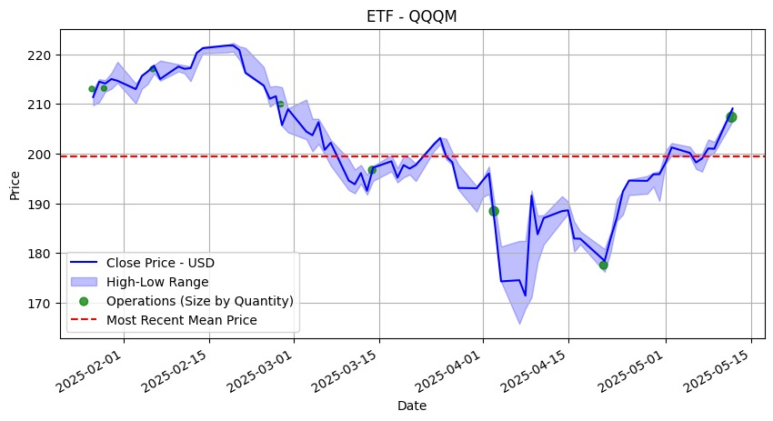
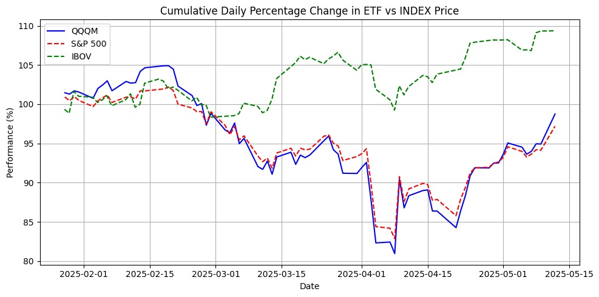
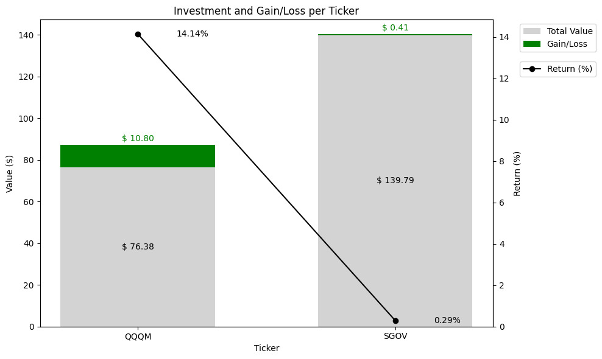

# Investment Project - Operations & Performance



This project is a tool for analyzing investment operations and comparing the performance of a selected ETF with major stock indices (S&P 500 and IBOVESPA). It uses Python, `pandas`, `matplotlib`, and `yfinance` to process, visualize, and compare investment data.

## Features

- **Import and process your investment operations** from an Excel file.
- **Fetch historical price data** for any ticker (ETF, stock, or index) using Yahoo Finance.
- **Calculate cumulative investment statistics** such as mean price, balance, and cumulative returns.
- **Visualize your operations** on price charts, including buy/sell markers and mean price lines.
- **Compare your investment performance** with S&P 500 (`^GSPC`, in USD) and IBOVESPA (`^BVSP`, in BRL).
- **Analyze wallet balance and performance:**  
  - Aggregate your holdings by ticker.
  - Calculate total invested value, current market value, and returns for each asset.
  - Visualize gain/loss and return (%) per ticker with annotated bar and line plots.
  - Print a summary of wallet composition, performance, and allocation.



## Wallet Balance Example

The wallet balance notebook (`ip_wallet_balance.ipynb`) provides:

- **Automatic import of your operations from Excel**
- **Real-time price fetching via Yahoo Finance**
- **Calculation of average purchase price, total quantity, and current value per ticker**
- **Return (%) and gain/loss visualization for each asset**
- **Summary printout of wallet allocation and performance**

Example output:

```
----------------------------------------
International Wallet Investment in ETFs
----------------------------------------
Amount:.............. $ 216.1700
Actual Value:........ $ 227.4100
Valorization:........ $ 11.2400
Wallet Performance:.. 5.20 %
----------------------------------------
QQQM
Value:............... $ 87.1800 (14.14 %)
Quantity:............ 0.5000    (40.00 %)
SGOV
Value:............... $ 140.2300 (0.29 %)
Quantity:............ 1.0000    (60.00 %)
```

And a plot showing investment, gain/loss, and return (%) per ticker.



## Requirements

- Python 3.8+
- Jupyter Notebook or VS Code with Jupyter extension
- Packages:
  - `pandas`
  - `matplotlib`
  - `yfinance`
  - `openpyxl` (for Excel file reading)

Install requirements with:
```bash
pip install pandas matplotlib yfinance openpyxl